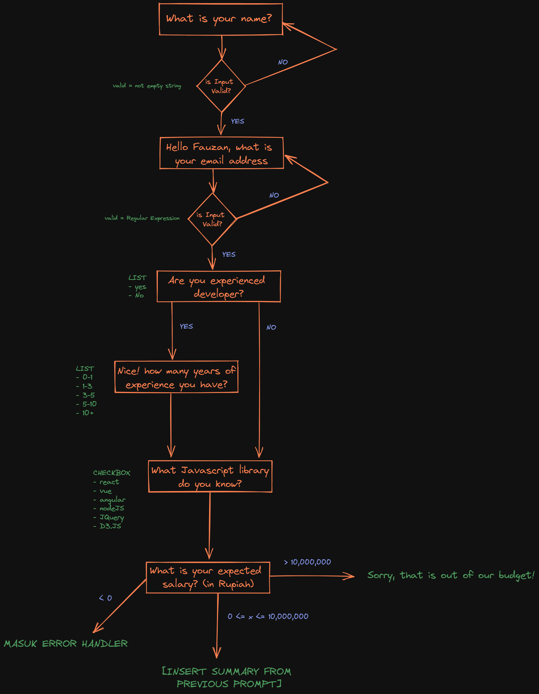
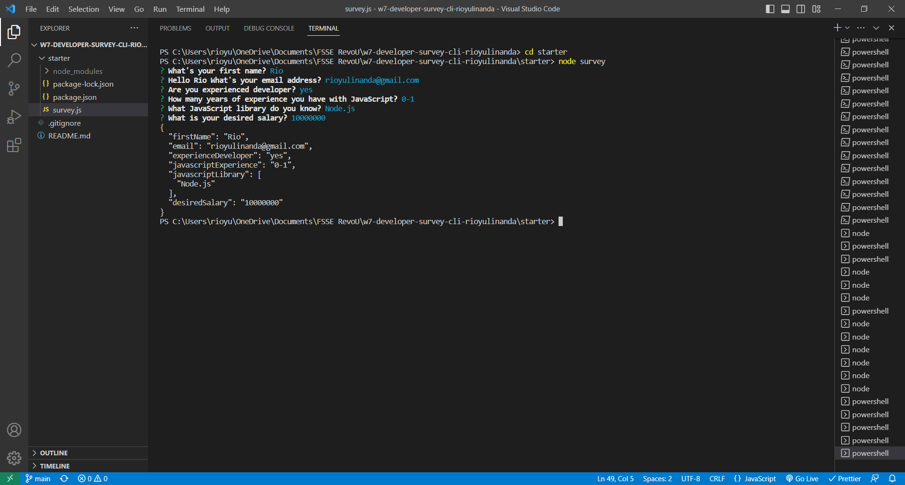
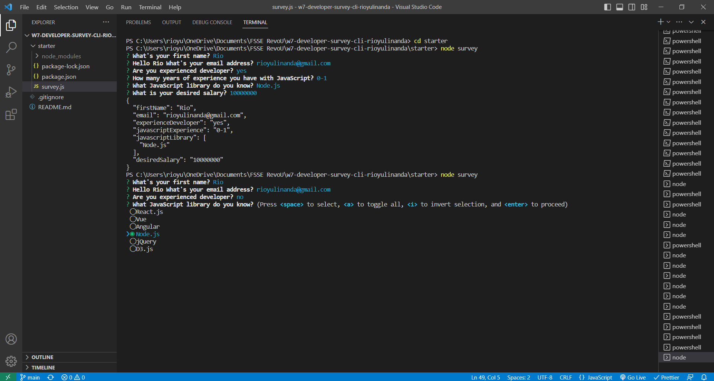
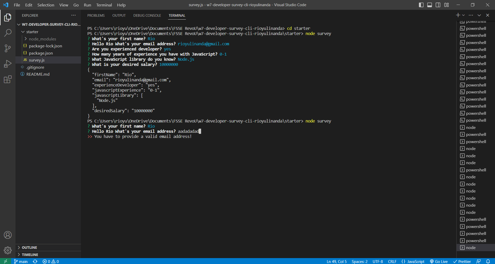
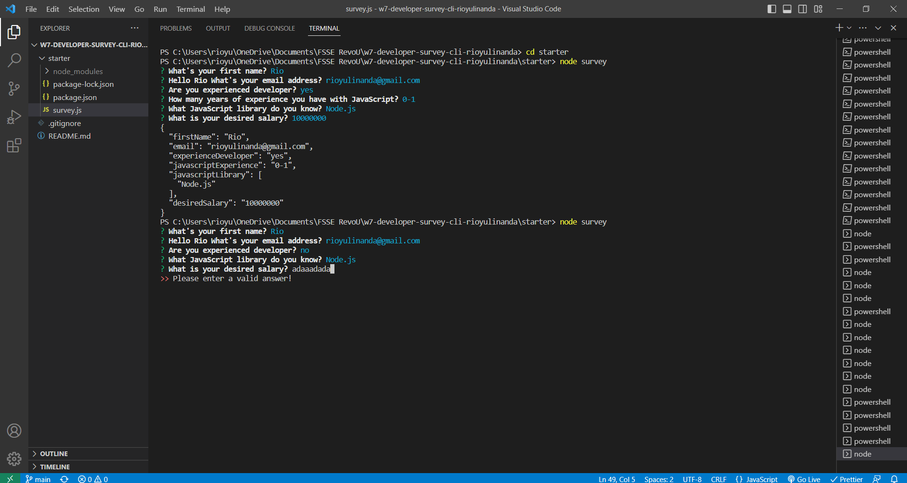
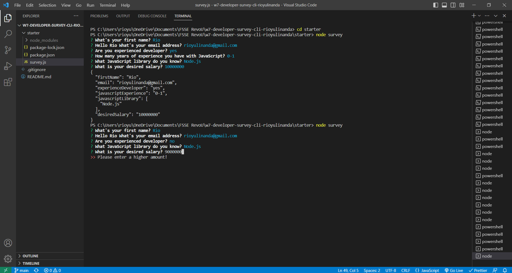
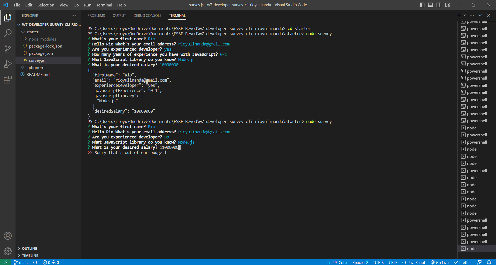

# Developer Survey CLI

- Assignment Example for Week 7: Programming — JavaScript, Node.js, npm, TypeScript

Will make Developer Survey using CLI and JavaScript

## Prerequisites

```
- Node.js
- NPM
  - Inquirer
- JavaScript
- Terminal

You can use starter code from folder starter

- What's your first name?
  Rules

  - Input type "input"
  - Validate not empty

- Hello (name from question 1) What's your email address?
  Rules

  - Input type "input"
  - Validate not empty

- Are you experienced Developer?
  Rules

  - Input type "list", [yes, no]
  - Validate not empty

- How many years of experience you have with JavaScript?
  Rules

  - Input type "list", ["0-1", "1-3", "3-5", "5-10", "10+"]
  - Validate not empty
  - Only show if question 3 selected "yes"

- What JavaScript library do you know?
  Rules

  - Input type "checkbox", ["React.js", "Vue", "Angular", "Node.js", "jQuery", "D3.js"]
  - Validate not empty
  - Only show if question 3 selected "yes"

- What is your desired salary?
  Rules
  - Input type "number"
  - Validate salary more than zero
  - Only show if question 3 selected "yes"
```

## Screenshots



This is basically the scheme of this survey.



This is the example of all answer is true.



This is the example of question "experienced developer" selecting "no", it will skip the the "how many years of experience" question.



This is the example of type invalid email, it should contain @ and .(this is using Regex).



This is the example of type invalid salary. Should be number.



This is the example of type salary, but below the budget.



This is the example of type salary, but out of the budget.
